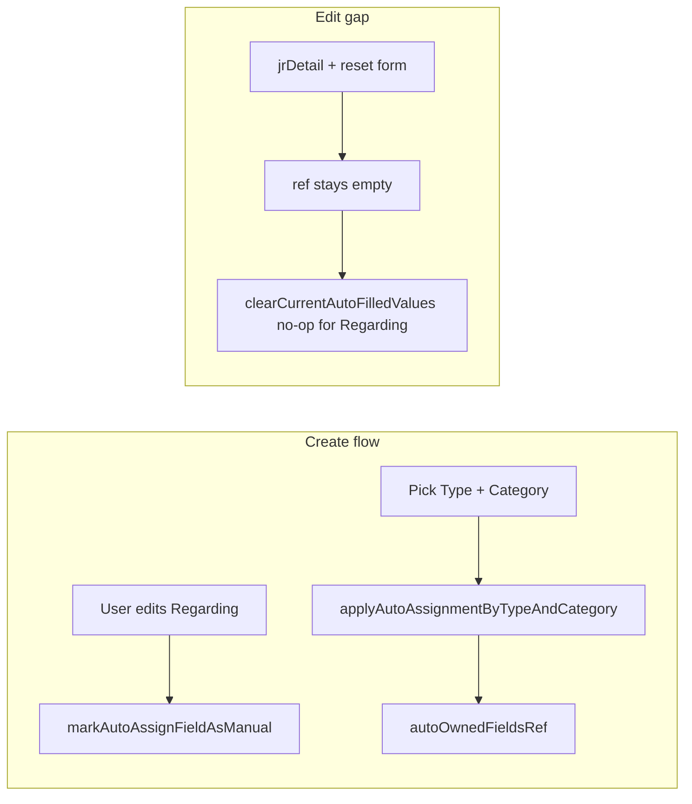

# Adapt job-request auto-assignment to full requirements

## What already matches (no change required for these behaviors)

- **Manual vs auto-fill**: [`markAutoAssignFieldAsManual`](App/Screens/JobRequest/AddOrEditJobRequest/index.js) on priority, team, PIC, observers removes fields from the auto-owned set so rules do not overwrite them.
- **Apply rule**: [`applyAutoAssignmentValues`](App/Screens/JobRequest/AddOrEditJobRequest/hooks/useJobRequestAutoAssignment.js) only writes when `isAutoOwned || isAutoAssignValueEmpty(currentValue)`; clears auto-owned slots when rule is missing or a rule field is empty.
- **Change Type**: [`onSelectArea`](App/Screens/JobRequest/AddOrEditJobRequest/index.js) calls `clearCurrentAutoFilledValues` first — correct **once** `autoOwned` reflects what was auto-filled.
- **Clear / change Category**: [`onSelectCategory`](App/Screens/JobRequest/AddOrEditJobRequest/index.js) calls clear when category is empty, or `applyAutoAssignmentByTypeAndCategory` when set — matches rows 2–4 and 3 for in-session flows.
- **Rule lookup**: [`getAutoAssignmentRuleByTypeAndCategory`](App/Screens/JobRequest/AddOrEditJobRequest/hooks/useJobRequestAutoAssignment.js) uses `categoryId` (Type) + `subCategoryId` (Category) consistently with the form.

## What is missing

### 1. Initialize `autoOwned` after edit load (core gap)

**Problem**: On edit, [`useEffect` resets `autoOwnedFieldsRef`](App/Screens/JobRequest/AddOrEditJobRequest/index.js) when `jrDetail?.id` changes, but nothing repopulates it from the loaded work order. So `clearCurrentAutoFilledValues` (rule `null`) only clears fields that became auto-owned **during this session** (e.g. after a category change). Persisted priority / team / PIC / observers from a JR that was auto-assigned earlier are treated as unknown — **they are not cleared** when Type or Category is removed/changed, which breaks **0.1**, **1**, **2**, and **2.1** on edit.

**What to change**

1. **[`useJobRequestAutoAssignment.js`](App/Screens/JobRequest/AddOrEditJobRequest/hooks/useJobRequestAutoAssignment.js)**  
   - Add a small API, e.g. `seedAutoOwnedFromLoadedJr({ typeId, categoryId, currentValues })`, that:
     - Resolves `rule` via existing `getAutoAssignmentRuleByTypeAndCategory(normalWorkOrderSettings, typeId, categoryId)`.
     - If there is no rule, leave ref empty (or only clear — ref should stay empty).
     - If there is a rule, for each field in `AUTO_ASSIGNMENT_FIELDS`, mark the field **auto-owned** only when the rule has a non-empty value **and** the current form value **equals** the normalized rule value (use the same shapes as `normalizeAutoAssignmentRule` — array order for IDs may need sorted comparison for `userIds` / `observerUserIds` to avoid false negatives).
   - Optionally export a **pure** helper `computeAutoOwnedFieldsFromRule(rule, currentValues)` for unit tests without the hook.

2. **[`AddOrEditJobRequest/index.js`](App/Screens/JobRequest/AddOrEditJobRequest/index.js)**  
   - After the form is populated for edit (`jrDetail` → `reset(getInitialValuesForUpdate())`) **and** `normalWorkOrderSettings` is available, call the seed function once per “logical load” (see timing below).
   - Pass `typeId` / `categoryId` from form or `jrDetail` (`categoryId` / `subCategoryId` — same mapping already used in `onSelectCategory`).

### 2. Async timing: `normalWorkOrderSettings` vs `jrDetail`

**Problem**: [`getNormalWorkOrderSettings`](App/Screens/JobRequest/AddOrEditJobRequest/index.js) runs on mount in parallel with `detailJR`. Settings may arrive **after** the `useEffect` that resets the form from `jrDetail`, so seeding only inside the `jrDetail` effect can miss the rule.

**What to change**

- Add a dedicated `useEffect` (or extend an existing one) with dependencies like `[isAddNew, jrDetail?.id, normalWorkOrderSettings, form reset complete]`, e.g.:
  - `if (isAddNew) return`
  - `if (!jrDetail?.id) return`
  - `if (!normalWorkOrderSettings?.length) return` (or whatever indicates “loaded” in your reducer)
  - Read current Type/Category from `getValues()` (or `jrDetail`) and call `seedAutoOwnedFromLoadedJr`.
- Guard with a ref (`lastSeededJrId` or `lastSeededSettingsVersion`) to avoid re-seeding on every unrelated render while still re-seeding when **settings** finish loading after detail.

### 3. Tests

- **[`AddOrEditJobRequest.spec.js`](App/Screens/JobRequest/AddOrEditJobRequest/AddOrEditJobRequest.spec.js)** (or hook-focused tests): cover `computeAutoOwnedFieldsFromRule` / seeding — e.g. rule matches all four fields → all in set; user value differs on one field → that field excluded; no rule → empty set.

## Optional / product decision (not strictly code)

- **Heuristic limit**: Seeding by “current value equals rule value” treats a user who **manually picked the same** priority/team/PIC/observers as the rule as auto-owned, so clearing Type/Category would still clear those fields. If that is unacceptable, you need an explicit **server flag** (per field or per WO) that auto-assignment was applied — that would be an API + payload change, not just mobile.

## Files to touch (minimal set)

| File | Purpose |
|------|--------|
| [`App/Screens/JobRequest/AddOrEditJobRequest/hooks/useJobRequestAutoAssignment.js`](App/Screens/JobRequest/AddOrEditJobRequest/hooks/useJobRequestAutoAssignment.js) | Pure seeding helper + hook method to assign `autoOwnedFieldsRef` |
| [`App/Screens/JobRequest/AddOrEditJobRequest/index.js`](App/Screens/JobRequest/AddOrEditJobRequest/index.js) | Call seed when edit + detail + settings are ready |
| [`App/Screens/JobRequest/AddOrEditJobRequest/AddOrEditJobRequest.spec.js`](App/Screens/JobRequest/AddOrEditJobRequest/AddOrEditJobRequest.spec.js) | Tests for seeding / equality edge cases |

No change required to [`RequestApi.js`](App/Services/RequestApi.js) or reducers unless you adopt server-side flags.
